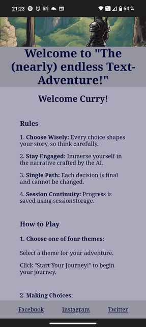
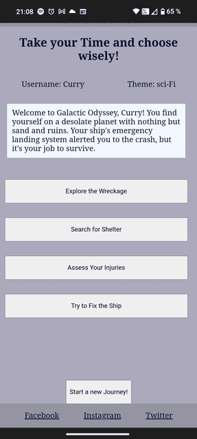
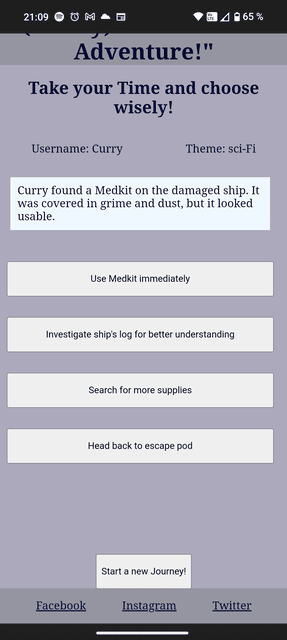
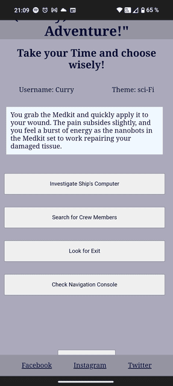

# The (nearly) endless Textadventure

Welcome to my Textadventure Website on which you will find a (nearly) never ending Story. It invites you to enter a username and choose one of three themes: Cyberpunk, Medieval Fantasy, Steampunk and Sci-Fi. But this is no ordinary Textadventure, as it uses an AI (Model - Llama 3 8b-8192) to give you an individual story as soon as you start the game. And as soon as you reach the end, you can easily restart the game with one click on a button.

This website has been created as the second Portfolio project for Code Institute's Full Stack Software Development Diploma. It was built using HTML, CSS and JavaScript. The Groq AI API is being used to narrate the story and give the user new options, aswell as a happy End. GitPod was used for writing the code for this website, as well as committing and pushing to GitHub. GitHub was then used to store the project after it had been pushed from GitPod. Once all the code had been written, GitPages was then used to deploy the website.

## Important Notice
- The API has a limit of 30 Requests per Minute, 14.400 Requests per Day with 30.000 Tokens per Minute.
- If you ever seem to encounter any catch error or the website loading for more than 30 seconds, please be patient, as the tokens and requests mentioned above may be in use already
- Should the Game stop working entirely even after waiting for at least 20 hours, please contact me, as the API Key has to be exchanged for a new one

## The (nearly) endless Textadventure

### View the live website [here](https://valejmdev.github.io/ThenearlyendlessTextadventurepp2/)
***
## Table of content: 
 1. [UX](#UX)
    1. [User Stories](#User-Stories)
    1. [Wireframes](#Wireframes)
    1. [Color](#Color)
    1. [Font](#Font)
    1. [Images](#Images)
 1. [Features](#Features)
    1. [General](#General)
    1. [Home page](#Home-page)
    1. [Gallery](#Gallery)
    1. [Contact](#Contact)
    1. [GROQ AI](#Groq-AI)
 1. [Testing](#Testing)
	1. [General Testing](assets/docs/readmepages/TESTING.md)
	2. [Mobile Testing](assets/docs/readmepages/TESTING.md)
	3. [Desktop Testing](assets/docs/readmepages/TESTING.md)
	4. [Functionality](assets/docs/readmepages/TESTING.md)
 	5. [Website Development Issues](assets/docs/readmepages/TESTING.md)
 	6. [Bugs](assets/docs/readmepages/TESTING.md)
 	7. [Technologies Used](assets/docs/readmepages/TESTING.md)
 	8. [Validation](assets/docs/readmepages/TESTING.md)
	    1. [W3C HTML](assets/docs/readmepages/TESTING.md)
	    2. [W3C Jigsaw](assets/docs/readmepages/TESTING.md)
       3. [JavaScript](assets/docs/readmepages/TESTING.md)
 	9. [Accessibility](assets/docs/readmepages/TESTING.md)
 	10. [Deployment](assets/docs/readmepages/TESTING.md)
 1. [Credits](#Credits)
      1. [Content](#Content)
      2. [Media](#Media)
      3. [Code](#Code)
 5. [Acknowledgements](#Acknowledgements)
***
## UX: 

### User Stories: 
#### Persona:
- Alex Johnson, The Enthusiastic Story Seeker
***
- **Personal Information:**
- Name: Alex Johnson

- Age: 28

- Occupation: Software Developer

- Location: Seattle, WA

- Education: Bachelor's Degree in Computer Science

- Hobbies and Interests:

- Reading and Writing: Alex loves reading fantasy and sci-fi novels and often writes short stories.
- Gaming: Enjoys a wide range of games, from RPGs to narrative-driven indie games.
- Technology: Fascinated by AI and how it can be used creatively.
- Board Games: Regularly hosts game nights with friends, enjoying both strategy and storytelling games.
****
- **Personality Traits:**

- Curious: Always eager to explore new ideas and experiences.
- Imaginative: Has a vivid imagination and loves getting lost in fictional worlds.
- Analytical: Enjoys understanding how things work, especially tech-related.
- Social: Likes sharing experiences and stories with friends.
*** 

- **Digital Behavior:**

- Tech-Savvy: Comfortable with new technology and often explores innovative websites and apps.
- Online Reader: Regularly reads articles, blogs, and forums about gaming, tech, and creative - writing.
- Engaged: Participates in online communities related to gaming and writing.
***
- **Goals:**

- Entertainment: Looking for engaging and immersive experiences to relax after work.
- Creativity: Interested in platforms that spark creativity and offer new storytelling experiences.
- Learning: Keen on exploring how AI can be used in creative ways and learning through interactive experiences.
***

- **Frustrations:**
- Repetitive Content: Dislikes games and stories that are too predictable or lack depth.
- Poor User Experience: Gets frustrated with websites that are difficult to navigate or have poor design.
- Lack of Personalization: Prefers experiences that feel tailored to their interests and choices.
***
- **Why Alex Would Love "The (nearly) endless Text Adventure":**

- AI-Driven Stories: The use of AI to create unique, adaptive stories fascinates Alex and aligns with their interest in technology and creativity.
- Personalization: The game addresses Alex by name and adapts the story based on their choices, providing a personalized experience.
- Variety: The choice of themes (Cyberpunk, Medieval Fantasy, Sci-Fi, Steampunk) caters to Alex's diverse interests in storytelling genres.
- Interactive Experience: The game offers an engaging, interactive way to unwind and get lost in a narrative after a long day of coding.
- Replayability: The ability to start a new adventure with different outcomes keeps Alex coming back for more.
***
- **Scenario:**

- After a productive day at work, Alex settles down with their laptop. Scrolling through a favorite tech blog, Alex comes across a feature about "The (nearly) endless Text Adventure," an AI-driven text adventure game. Intrigued by the combination of storytelling and cutting-edge AI, Alex decides to give it a try.

- Entering their username and selecting the "Cyberpunk" theme, Alex is immediately drawn into a futuristic narrative. Each decision feels impactful, and the personalized elements make the adventure feel uniquely their own. After reaching the end and enjoying the satisfying conclusion, Alex feels inspired and refreshed.

- Excited by the experience, Alex shares the game with friends at the next board game night, eager to see the different adventures and outcomes each person experiences. "The (nearly) endless Text Adventure" quickly becomes a favorite topic of discussion, blending their love for technology, storytelling, and interactive entertainment.

***

#### Detailed User Journey for Alex Johnson
##### Discovery and Initial Interest:

1.  **Touchpoint**: Tech blog article.
   
2.  **Action**: Alex reads about "The (nearly) endless Text Adventure" and is intrigued by the AI-driven storytelling aspect.
   
3.  **Emotion**: Curiosity and excitement

4.  **Pain Points**: None at this stage

5.  **Opportunities**: Catch Alex's interest with the novelty of AI integration in storytelling.

      
***
####  First Visit to the Website:

1.  **Touchpoint**: Homepage of "The (nearly) endless Text Adventure"
   
2.  **Action**: Alex visits the website, where they see a simple, engaging prompt to enter their username.
   
3.  **Emotion**: Anticipation and interest

4.  **Pain Points**: Potential hesitation if the site looks overly complex or unwelcoming.

5.  **Opportunities**: Ensure the homepage is clean, inviting, and clearly explains the innovative aspect of the game.

***
#### Entering Username

1.  **Touchpoint**: Username input page
   
2.  **Action**: Alex enters their username and clicks "Next".
   
3.  **Emotion**: Engagement and personal connection

4.  **Pain Points**: None, assuming a smooth input process.

5.  **Opportunities**: Reinforce the personalized nature of the adventure right from the start.

***
#### Choosing a Theme

1.  **Touchpoint**: Theme selection page
   
2.  **Action**: Alex is greeted by name, provided with rules and instructions, and chooses the "Cyberpunk" theme.
   
3.  **Emotion**: Excitement and readiness

4.  **Pain Points**: Overly long or complicated instructions might reduce engagement.

5.  **Opportunities**: Keep instructions concise and engaging, and present theme options with appealing visuals.

***
#### Immersive Gameplay

1.  **Touchpoint**: Game page
   
2.  **Action**: Alex starts the adventure. The AI generates the story and presents four choices at each step. Alex makes decisions and progresses through six parts of the story.
   
3.  **Emotion**: Immersion, excitement, and curiosity

4.  **Pain Points**: Potential frustration if the story or options are repetitive or uninteresting.

5.  **Opportunities**: Ensure the AI generates diverse and engaging storylines. Use appealing UI to keep the user engaged.

***

#### Story Conclusion

1.  **Touchpoint**: Endgame page
   
2.  **Action**: After the seventh choice, Alex is redirected to the endgame page where a happy ending summary is presented. Alex reads the personalized conclusion and feels a sense of completion.
   
3.  **Emotion**: Satisfaction and delight

4.  **Pain Points**: If the summary is too brief or disconnected from the choices made.

5.  **Opportunities**: Craft a detailed, cohesive ending that reflects the player's journey and decisions. Personalize the conclusion with the username.

***

#### End of Session

1.  **Touchpoint**: Endgame page
   
2.  **Action**: Alex reads a thank you message and uses the reset button to clear the session and potentially start a new adventure.
   
3.  **Emotion**: Appreciation and eagerness to play again

4.  **Pain Points**: If the reset process is unclear or if there's no clear call to action.

5.  **Opportunities**: Ensure the thank you message is heartfelt and the reset button is clearly labeled and functional.

***

#### Sharing and Re-engagement

1.  **Touchpoint**: Social media, friends
   
2.  **Action**: Alex shares their experience with friends and on social media, and returns to the game for a new adventure with a different theme.
   
3.  **Emotion**: Enthusiasm and pride

4.  **Pain Points**: If re-engaging with the game feels repetitive.

5.  **Opportunities**: Highlight the replayability and variety of themes and stories to encourage repeat visits. Add social sharing buttons to facilitate easy sharing of the experience.

***

### Wireframes: 
- I created my Wireframes in preparation for the project with Balsamiq.
- While creating the website you can see today, i had to change some elements for design and time reasons.
- To see all my Wireframes:

**Elements you might find missing from the live Website:**
Here is an example from my Index page:
#### Desktop Index Page 

#### Mobile Index Page

- To see all Wireframes, click [here](assets/docs/readmepages/WIREFRAMES.md)
***
### Color: 
- I have thought about this design myself and had no direct inspiration.
- I created a color palette [here](https://mycolor.space/?hex=%23020735&sub=1)
- On the website mycolor.space i chose the Classy Palette, because the colors correspond with the colors of the images i uploaded and have been edited slightly with two additions for better contrast.

- I tested my Color Contrast with this [Website](https://coolors.co/contrast-checker/020735-f0f8ff)

I got the following values, which solidified my design choice:

***

***

***
***
### Font: 
- I have not set any font to ensure full accessability due to using standard font of browser.
- I found it to fit the page quite good and have not found any other font that i like better for ths project.
- It gives a classic vibe and a doesn't distract from other elements.
***
### Images: 
- I created all images myself with the huggingface website: [here](https://huggingface.co/spaces/google/sdxl)
- I have created my own prompts to create the pictures you can see in the project.
- I decided to not use more pictures to not overwhelm the user 
- All mobile screenshots have been taken with my Nothing Phone(2).
- All Desktop Screenshots have been taken in Google Chrome on a 1920x1080 resolution.

***
## Features: 

### Index Page
**URL:** [index.html](https://valejmdev.github.io/ThenearlyendlessTextadventurepp2/index.html)
#### Desktop

#### Mobile

- **Username Input:** Here the user can enter their desired username that will be used in the game.
- **Start Button:** Validates the username and proceeds to redirect the user to the next page.
- **Session Storage:** Saves the username for later use in the story and displays.
- 

### Theme Page
**URL:** [theme.html](https://valejmdev.github.io/ThenearlyendlessTextadventurepp2/theme.html)
#### Desktop

- **Greeting:** Displays a welcome message with the entered username.
- **Rules and Instructions:** Explains how to play and the rules of the game.
#### Desktop

#### Mobile

- **Theme Selection:** Users choose one of four themes: Cyberpunk, Medieval Fantasy, Sci-Fi, and Steampunk that will be used to create the story the user desires.
- **Start Button:** Saves the selected theme in the Session Storage and navigates the user to the game page.
#### Desktop

#### Mobile

### Game Page
**URL:** [game.html](https://valejmdev.github.io/ThenearlyendlessTextadventurepp2/game.html)

- **Username and Theme Display:** Shows the current username and theme.

- **Reset Button:** Resets all inputs stored in the Session storage and redirects to the username 
input page.

- **Story Display:** Shows the current part of the story generated by the AI based on the inputs the user entered earlier.
- **Choice Buttons:** Four buttons allow users to make choices that affect the story's progression.
- **Story Progression:** Plays through six parts of the story, updating with each choice. On Part seven, the user will be redirected to the endgame page, where the story will come to an end.

#### Desktop Example Cyberpunk
- 
- 
- 
- 
- 
- 

***
#### Mobile Example Sci-Fi
- 
- 
- 
- 
- 
- 

### Endgame Page
**URL:** [endgame.html](https://valejmdev.github.io/ThenearlyendlessTextadventurepp2/endgame.html)

- **Summary Display:** Presents a happy ending summary based on the player’s journey.

- **Thank You Message:** Thanks the player using their provided username.
- **Restart Button:** Resets all inputs stored in the Session storage and redirects to the username input page.

- These features ensure a seamless user experience, from entering a username to enjoying a personalized AI-driven adventure and concluding with a customized happy ending.

### Groq AI
- In "The (nearly) endless Text Adventure," we leverage Groq's AI API with the Llama-3-8b-8192 model to create dynamic, AI-generated narratives. 
- The prompt used is tailored to incorporate the user's username, chosen theme, and previous choices, ensuring that each story segment is uniquely crafted. 
- This implementation enhances replayability and provides a more personalized experience, allowing users to explore different story paths based on their inputs. 
- The AI-driven approach ensures that each adventure is distinct, engaging, and tailored to the individual player's journey.
- I used this documentation for the implementation [here](https://console.groq.com/docs/quickstart)
- Groq is a free Website, offering the user a selection of state of the art AI Models and a free API Key Generator with a very easy to understand documentation.
- With the help of [this Stackoverflow Blog](https://stackoverflow.com/questions/78391185/how-do-i-avoid-sdk-and-use-raw-fetch-with-groq-api) i was able to implement the AI Narrator successfully.
- The API has a limit of 30 Requests per Minute, 14.400 Requests per Day with 30.000 Tokens per Minute.
- If you ever seem to encounter any catch error or the website loading for more than 30 seconds, please be patient, as the tokens and requests mentioned above may be in use already
- Should the Game stop working entirely even after waiting for at least 20 hours, please contact me, as the API Key has to be exchanged for a new one
- There is no billing account attatched to the Groq Account, so please bear in mind, that the usage is limited. 
- If you want to enter your own API Key after Cloning the Project, followning i will explain how to create a Groq AI API Key.

#### How to create a Groq AI API Key
- Go to [Groq](https://groq.com) and create an account or log in to your existing one.
- After logging in add to the url a "console.groq.com" or use [this link](https://console.groq.com/playground)
- On the left hand site you have 4 options, choose the third one "API Keys"
- Click on the "Create API Key"
- Enter a name for your API Key
- Copy the created Secret Key and store it safely and if possible do not make it public
- My API Key is publicly visible, due to no safe way to store it, when deploying via GitHub Pages and I acknowledge the possibilities and risks coming with it.

### Missing Features
- An image generating AI to create a image of each scene described, but due to time restrictions the implementation is postponed to the future.
- Depending on the chosen theme the Header Images should be exchanged, but due to time restrictions the implementation is postponed to the future.
***
## Testing
**Due to the length of my Testing Section, i have created an extra Page**

[Click Here](assets/docs/readmepages/TESTING.md)
***

## Deployment: 
This project was developed using [GitPod](https://gitpod.io/) and [VSCode](https://code.visualstudio.com), committed and pushed to [GitHub](https://github.com/) using a GitPod terminal.

-   This site was deployed by completing the following steps:

The steps to activate Github pages are as follows:
1.   Navigate to the settings tab in the GitHub repository.
2.   In the settings, navigate to the 'Pages' tab on the left of the page.
3.   In the 'Build and deployment' section, select 'Deploy from a branch' in the source dropdown.
4.   Select branch 'main' and click on 'Save'.

The live link can be found here:  [The nearly Endless Textadventure](https://valejmdev.github.io/ThenearlyendlessTextadventurepp2/)
***
### Forking This Project

-   Fork this project following the steps:

1.  Open  [GitHub](https://github.com/).
2.  Click on the project to be forked.
3.  Find the 'Fork' button to the top right of the page.
4.  Once you click the button the fork will be in your repository..
***
### Cloning This Project
-   Clone this project following the steps:

1.  Open  [GitHub](https://github.com/).
2.  Click on the project to be cloned.
3.  You will be provided with three options to choose from, HTTPS, SSH or GitHub CLI, click the clipboard icon in order to copy the URL..
4.  Once you click the button the fork will be in your repository.
5.  Open a new terminal.
6.  Change the current working directory to the location that you want the cloned directory.
7.  Type 'git clone' and paste the URL copied in step 3.
8.  Press 'Enter' and the project is cloned.

Further Information on how to deploy the project on VS Code and even more can be found [here](https://github.com/MicrosoftDocs/visualstudio-docs/blob/main/docs/get-started/tutorial-open-project-from-repo.md)!
***

### Credits

#### Content:
- [Groq AI API for Llama3-8b-8192](https://console.groq.com/keys) - The AI that creates an awesome story, offers you new options to choose from, and even writes a happy end based on all your choices.

#### Media:
- [Hugging Face Image Generator](https://huggingface.co/spaces/google/sdxl) - For the beautiful images on my page, created with personally created prompts.
- [Short Pixel](https://shortpixel.com) - To resize all images I have used this website.
- [GetBootstrap Blog](https://getbootstrap.com/docs/5.0/layout/breakpoints/) - For the information about appropriate breakpoints for responsive design.
- [MyColor Space](https://mycolor.space/?hex=%23020735&sub=1) - For color palette creation and orientation.

#### Code:
- [GeeksforGeeks Footer Display Issue Fix by "position: fixed;"](https://www.geeksforgeeks.org/how-to-create-footer-to-stay-at-the-bottom-of-a-web-page/) - helped me with my display issue of the footer being in the middle of the page instead of at the bottom of the page.
- [Mega-Barrel Text-Adventure](https://github.com/Mega-Barrel/Javascript-Text-Adventure-Game) - For inspiring me how to create appropriate storage systems for the story and other input variables.

#### W3Schools:
- [How to Redirect to Another Webpage](https://www.w3schools.com/howto/howto_js_redirect_webpage.asp) - Learn how to redirect to another webpage using JavaScript.
- [HTML DOM Element addEventListener](https://www.w3schools.com/jsref/met_element_addeventlistener.asp) - Learn how to use HTML DOM Element addEventListener() in JavaScript.
- [JavaScript Fetch API](https://www.w3schools.com/jsref/api_fetch.asp) - Learn how to use JavaScript Fetch API used for the Groq AI API Implementation.
- [HTML Forms](https://www.w3schools.com/html/html_forms.asp) - Learn more about the different elements in a Form Element and how to use them properly.
- [CSS Grid Layout Module](https://www.w3schools.com/css/css_grid.asp) - Learn how to use the CSS Grid Layout to align my option buttons.
- [Using HTML `<select>` Form Attribute](https://www.w3schools.com/tags/att_select_form.asp) - Learn how to utilize the select element to create a storable theme selector.

#### StackOverflow:
- [How to Dynamically Load Content into DIV Using JavaScript](https://stackoverflow.com/questions/45030059/how-to-dynamically-load-content-into-div-using-javascript) - Learn how to dynamically load content into a DIV using JavaScript for my story's text to be updated.
- [How to Use sessionStorage for a Webpage for a Login User](https://stackoverflow.com/questions/52697055/how-to-use-sessionstorage-for-a-webpage-for-a-login-user) - Learn how to use sessionStorage for a webpage to store username and use it later on.
- [How to Display JavaScript Variable Value on HTML Page](https://stackoverflow.com/questions/60576383/display-javascript-variable-value-on-html-page) - Learn how to use the stored username and theme to be displayed and not only used by the AI narrator.
- [How to Submit Form After Calling e.preventDefault()](https://stackoverflow.com/questions/22363838/submit-form-after-calling-e-preventdefault) - Learn how to submit a form that has been stopped by `preventDefault();`.
- [How to Avoid SDK and Use Raw Fetch with Groq API](https://stackoverflow.com/questions/78391185/how-do-i-avoid-sdk-and-use-raw-fetch-with-groq-api) - Learn how to implement the Groq AI API and how to use prompts and store its response, as well as send new prompts dynamically.
- [How to Combine Pattern with Maxlength of Input Field](https://stackoverflow.com/questions/11264954/combine-pattern-with-maxlength-of-input-field) - Learn how to combine pattern with maxlength of input field to validate my username input and restrict too long names that could destroy my current CSS display rules.

#### MDN:
- [All About XMLHttpRequest](https://developer.mozilla.org/en-US/docs/Web/API/XMLHttpRequest) - Learn about XMLHttpRequests until I found out I have to use the fetch(); method.
- [Using the Fetch API](https://developer.mozilla.org/en-US/docs/Web/API/Fetch_API/Using_Fetch) - Learn how to use the Fetch API and all the elements that go into it.
- [All About Promise](https://developer.mozilla.org/en-US/docs/Web/JavaScript/Reference/Global_Objects/Promise) - Learn all about Promise-based requests to implement a functional Groq AI API.
- [All About Element](https://developer.mozilla.org/en-US/docs/Web/API/Element) - Learn all about different methods that are able to be used via an element.

### Acknowledgements:
- A very special thanks to Pascal, the most helpful person I ever met. He has helped me tremendously with ideas, fixes, and feedback.
- I also want to thank my Mentor Rory-Patrick who gave me so many tips and tricks, and inspired me along the way.
- Also, very special thanks to my dog who provided emotional support and times to unwind.
- I thank all my peers in my course, who provided a lot of support and feedback!
- I thank all my family members and friends who not only gave feedback and support but also tested it on their devices.

> Written with [StackEdit](https://stackedit.io/).

[Back to the top](#Table-of-content)
