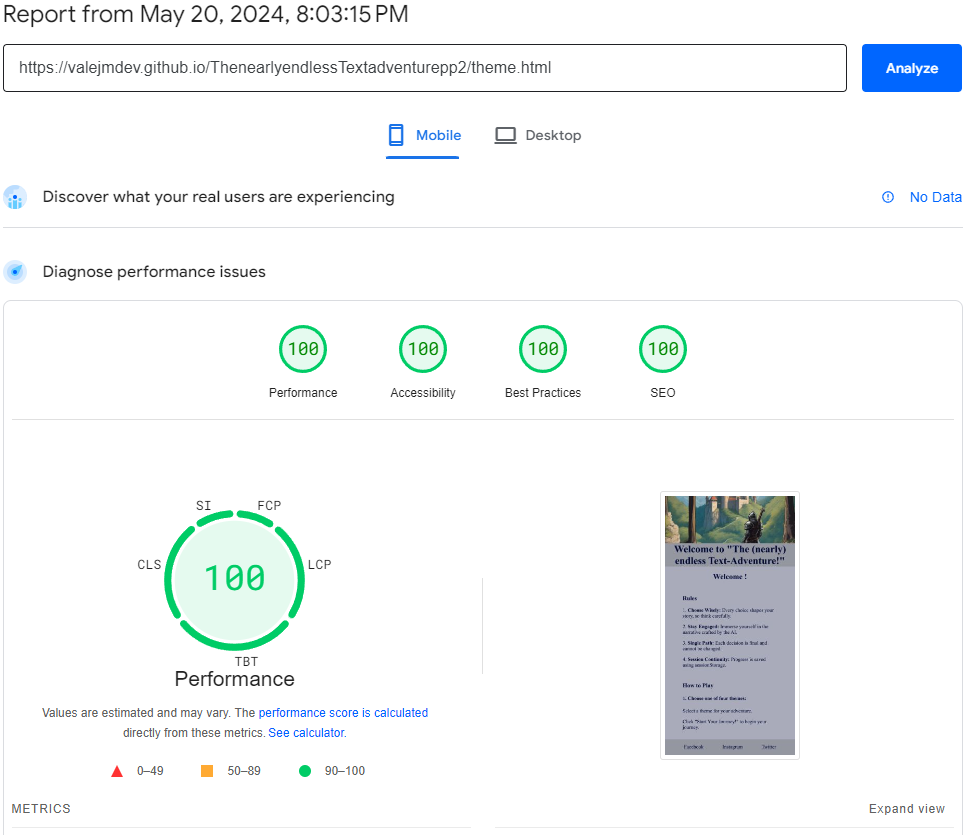

## Testing:  
 1. [Testing](#Testing)
	1. [General Testing](#General-Testing)
	2. [Mobile Testing](#Mobile-Testing)
	3. [Desktop Testing](#Desktop-Testing)
	5. [Manual Testing](#Manual-Testing)
	4. [Functionality](#Functionality)
 	5. [Website Development Issues](#Website-Development-Issues)
 	6. [Bugs](#Bugs)
 	7. [Technologies Used](#Technologies-Used)
 	8. [Validation](#Validation)
        1. [W3C HTML](#W3C-HTML)
        2. [W3C Jigsaw](#W3C-Jigsaw)
        3. [JavaScript](#JavaScript)
 	9. [Accessibility](#Accessibility)
***
### General Testing
-   Each feature was developed on the main branch. 
-   Each time a feature was added, all the functions were tested to see if there was an impact.
-   The site was sent to friends and relatives for feedback and testing.
-   The username input has a validation and will not submit without the proper information.
-   .gitignore file has been included to prevent system file commits.
-   The image loading blur has been thoroughly tested and gone through numerous iterations to optimized the smoothness of the transition on different devices and internet speeds.
-   External links open in a new tab.
***
### Mobile Testing

-   I tested the site personally on my Android device, going through the entire process, checking buttons, functions, restarting the game, etc. I was personally unable to test on iOS.
-   The site was sent to friends and relatives for them to follow the same process. They have tested on their devices, only missing iOS devices.
- The testing was done using the Google Chrome Browser. Chrome Developer Tools were used extensively, particularly to check responsiveness on different screen sizes. Testing was also done using Firefox and Opera on desktop, and again on Google Chrome and Opera and Brave on the Nothing Phone (2).
-   Responsive on all device sizes between 320px - 2600px wide.
-   Devices tested using the Google Developer Tools emulator:

| Device                   | Device Size    | Tested |
|--------------------------|----------------|--------|
| BlackBerry Z30           | 360px x 640px  | ✅     |
| BlackBerry PlayBook      | 600px x 1024px | ✅     |
| Samsung Galaxy Note 3    | 360px x 640px  | ✅     |
| Samsung Galaxy S3        | 360px x 640px  | ✅     |
| Samsung Galaxy S9+       | 320px x 658px  | ✅     |
| LG Optimus L70           | 384px x 640px  | ✅     |
| Microsoft Lumia 550      | 640px x 360px  | ✅     |
| Microsoft Lumia 950      | 360px x 640px  | ✅     |
| Nexus 4                  | 384px x 640px  | ✅     |
| Nokia Lumia 520          | 320px x 533px  | ✅     |
| Nokia N9                 | 480px x 854px  | ✅     |
| Pixel 3                  | 393px x 786px  | ✅     |
| Apple iPad Mini          | 468px x 4024px | ✅     |
| Apple iPhone 4           | 320px x 480px  | ✅     |
| Apple iPhone 5/S         | 320px x 568px  | ✅     |
| Apple iPhone 6/7/8       | 375px x 667px  | ✅     |
| Apple iPhone 6/7/8 Plus  | 414px x 736px  | ✅     |
| Apple iPhone X           | 375px x 812px  | ✅     |
***
### Desktop Testing
-   The site was developed on a Desktop PC and the majority of testing occurred on Chrome.
-   The site was tested by friends and relatives on numerous desktop devices.
-   The site was marginally tested on other browsers, such as Firefox and Opera.
-   Internet Explorer was not tested and the site was not developed with it in mind as support for the browser is gradually 		being dropped.
***

### Manual Testing
- As mentioned int the Testing Parts above i have tried every possible theme and all options buttons
- I have reseted the game with the reset button in any part and any theme of the game, ensuring that it works
- I have provided screenshots to the **Features** Part of this Readme.
- Due to very high replayability it is not possible to create screenshots for all possible Game scenarios.

### Functionality
-   All links have been hovered and clicked to ensure accessibility.
-   Pages all load correctly on all device screen sizes.
-   All social media links work correctly and open on a new tab.
-   All images load on each page as intended.
-   All the buttons are working correctly and bring the users to the function that they were built for.
-   I have run through all themes multiple times with different usernames and ensured full functionality
***
## Website Development Issues
    
At the initial stages of my project, I made an error how to structure my JavaScript Code. Following my second call with my mentor, he clarified to separate the JavaScript to different documents, and I have followed his recommended approach.

***
## Technologies Used

For the purpose of this project, the following technologies were used.

### Languages:
- **HTML**
- **CSS**
- **JavaScript**
***
### Frameworks, Libraries, Programs & Applications Used:
- **Google Font** were used to import the following fonts Montserrat and Lato. These were imported to style.css and were used throughout the project.
- **Font Awesome** was used on each page of the website to provide icons for UX purposes.
- **GitPod** was used for writing all the code for this project. It was also used to commit and push to GitHub.
- **VSCODE** was used for writing and testing the code localy for this project. It was also used in combination with GitPod.
- **GitHub** was used to store this project.
- **GitPages** was used to deploy the project.
- **Balsamiq** was used to draw initial Wireframes for this project.
- **Stackedit** was used to write the README files
- **Am I Responsive** was used to check that each page of the site was responsive. It was also used to create the mock-up image seen at the beginning of this document.
- **Google Development Tools** were used to edit code and check responsiveness before making the changes permanent.

***
## Bugs

This table summarizes the issues encountered, their current status, and any actions taken to address them.

| Issue                                                          | Status                                        |
|----------------------------------------------------------------|-----------------------------------------------|
|Update Story function did not initialise the first story part | ✅ I fixed by seperating JavaScript in different pages |
|Display Issue of footer being displayed in the middle of the screen  | ✅ I gave the footer position fixed and margin top|
|Display Issue of Theme Selector page  | ✅ Add flexbox system with a lot of margin and padding |
|Catch error described and screenshot provided in following JavaScript Part  | ❌ Not able to find definite cause, as it could be connection issue, API Loading times or other factors. Due to time restriction and no impact on functionality, i will fix this in the future. |

***
## Validation: 
### W3C HTML: 
I used the [W3C HTML Validator](https://validator.w3.org/nu/)

| Pages    | Screenshot                                    |
|----------|-----------------------------------------------|
| Username     |  |
| Theme  |  |
| Game  |  |
| Engame 	   |  |

### W3C Jigsaw: 
I used the [W3C CSS Jigsaw Validator](https://jigsaw.w3.org/css-validator/)

### JavaScript
- I used the [JSHint JavaScript Validator](https://jshint.com/)
- I added the /**jshint esversion: 11**/ to validate my code, as i used functions up to that version.

- There were no errors with any of my JavaScript Pages, while checking with JSHint.

- I received one warning, which asked me to create my function **updateStory** outside the loop, but due to time restrictions, i am not able to rewrite the code to do so. This warning only considers this to be confusing to read for a third party, not critical to any functionality.
***

***
- I also sometimes receive error messages inside the console, that are explaining, that the **fetch** method, was not able to create the text it receives, due to a format issue. 
- This error is not breaking the code and is being console logged in a **catch** method.

***
## Accessibility: 
I used the Chrome Lighthouse tool and received different scores for different pages and devices.
| Environment         | Page   | Screenshot                                    |
|---------------------|--------|-----------------------------------------------|
| Local Host Mobile   | Username   |      |
| Local Host Mobile   | Theme|  |
| Local Host Mobile   | Game|  |
| Local Host Mobile   | Endgame|  |
| Local Host Desktop  | Username   |      |
| Local Host Desktop  | Theme|  |
| Local Host Desktop  | Game|  |
| Local Host Desktop  | Endgame|  |
| Github Pages Mobile | Username   |  |
| Github Pages Mobile | Theme|  |
| Github Pages Mobile | Game|  |
| Github Pages Mobile | Endgame|  |
| Github Pages Desktop| Username   |  |
| Github Pages Desktop| Theme|  |
| Github Pages Desktop| Game|  |
| Github Pages Desktop| Endgame|  |

[Back to the top](#Testing)