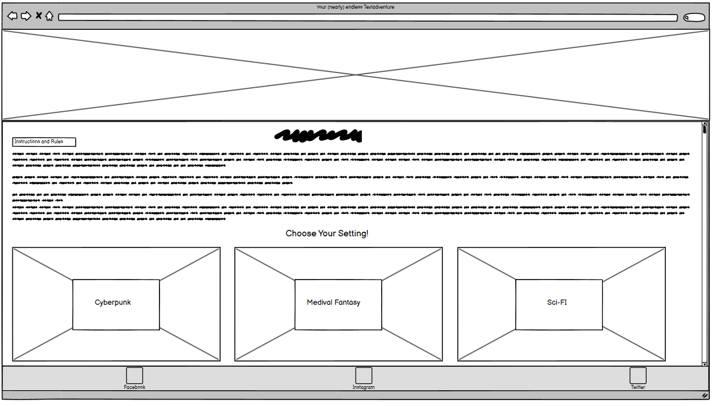
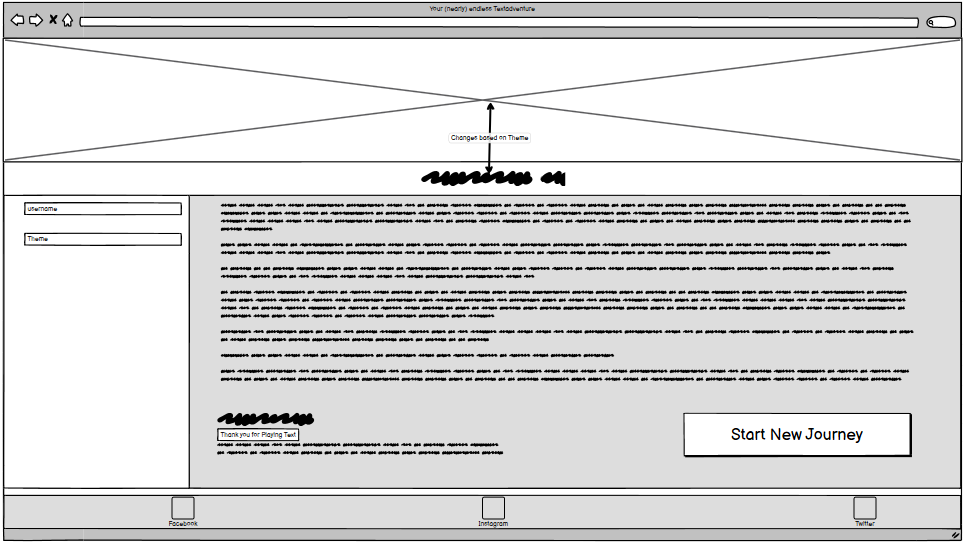
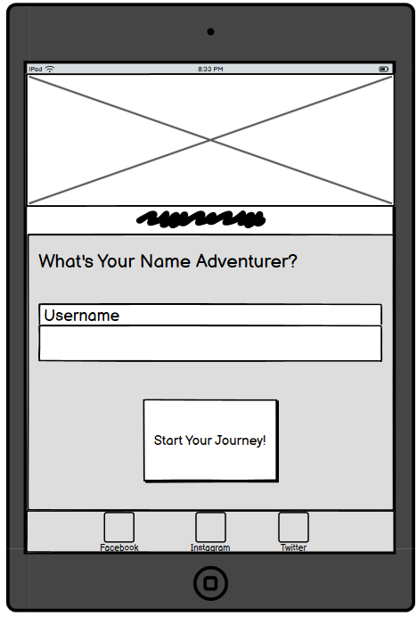
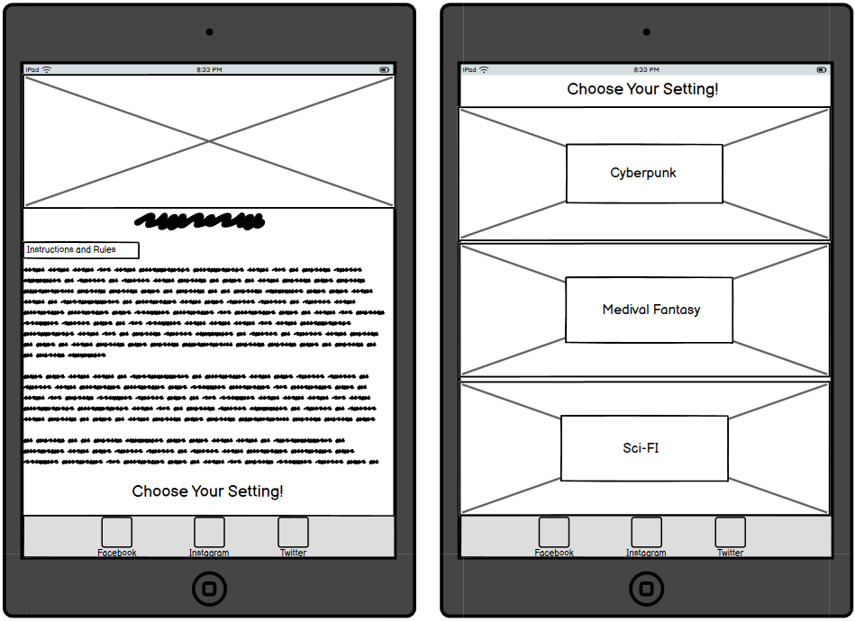
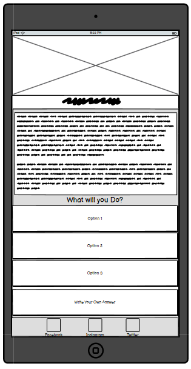
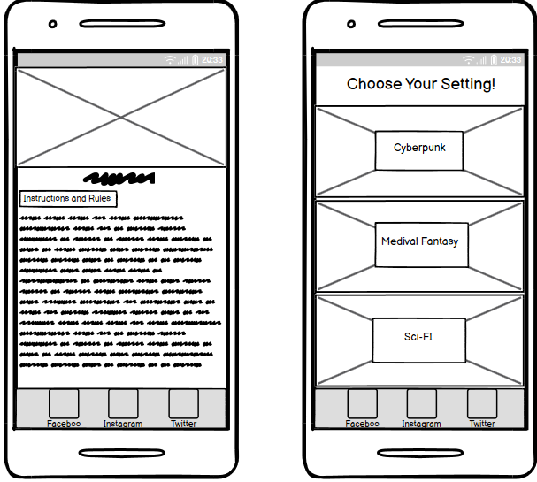
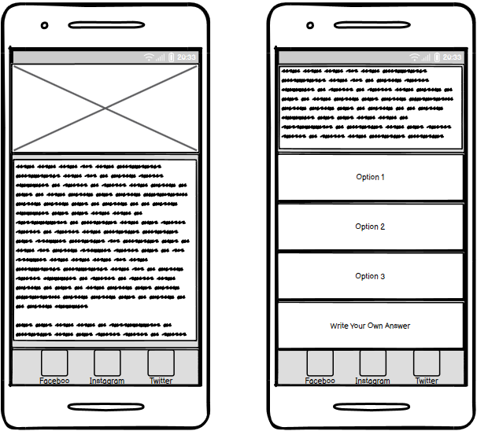

# Wireframes
Following you'll see the Wireframe i created in preparation for this project.

## Desktop

### Username page

***
### Theme page

***
### Game page
 
***
### Endgame page

## Tablet

### Username page

***
### Theme page
 
***
### Game page

***
### Endgame page 

## Mobile

### Username page

***
### Theme page

***
### Game page

***
### Endgame page

[Back to the top](#Wireframes)